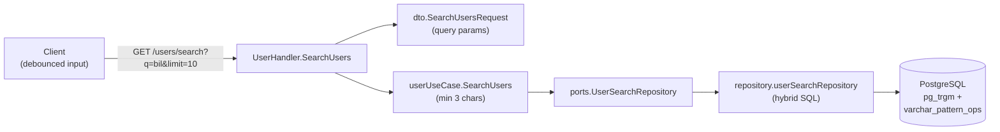

# User Search Endpoint — Design Spec

> **Date:** 2026-07-28
> **Status:** Approved
> **Approach:** A — Hybrid Single-Query (exact → prefix → trigram)

## Overview

Add `GET /users/search?q=<query>&limit=<n>` to search users by username using PostgreSQL trigram (`pg_trgm`) and prefix (`varchar_pattern_ops`) indexes. The endpoint is public (no auth), designed for a debounced autocomplete/typeahead UX.

## Requirements

| # | Requirement | Detail |
|---|-------------|--------|
| R1 | Public endpoint | No authentication required |
| R2 | Query param `q` | Minimum 3 characters, required |
| R3 | Query param `limit` | 1–20, default 10, optional |
| R4 | Response shape | `{ "data": [{ "username": "...", "name": "..." }] }` |
| R5 | Result ordering | Exact match → prefix match → trigram similarity |
| R6 | Trigram index | `pg_trgm` GIN index on `users.username` |
| R7 | Prefix index | B-tree `varchar_pattern_ops` on `users.username` |
| R8 | Empty results | Returns `{ "data": [] }` with 200, not 404 |
| R9 | Error format | RFC 9457 Problem Details for all errors |

## Architecture



### New port: `UserSearchRepository`

A separate driven port (not added to `UserRepository`) because search is a fundamentally different concern from CRUD. This keeps existing interfaces stable and follows the Interface Segregation Principle.

## Database

### Migration (`000013_add_user_search_indexes`)

```sql
-- up.sql
CREATE EXTENSION IF NOT EXISTS pg_trgm;
CREATE INDEX idx_users_username_prefix ON users USING btree (username varchar_pattern_ops);
CREATE INDEX idx_users_username_trgm ON users USING gin (username gin_trgm_ops);
```

```sql
-- down.sql
DROP INDEX IF EXISTS idx_users_username_trgm;
DROP INDEX IF EXISTS idx_users_username_prefix;
```

### Hybrid Search Query

```sql
SELECT username, first_name, last_name
FROM users
WHERE username % $1                       -- pg_trgm similarity operator
   OR username LIKE $2 || '%'             -- prefix match
ORDER BY
    CASE WHEN username = $2 THEN 0        -- exact (highest)
         WHEN username LIKE $2 || '%' THEN 1  -- prefix
         ELSE 2                           -- trigram fuzzy
    END,
    similarity(username, $2) DESC         -- secondary sort by trigram score
LIMIT $3;
```

Parameters: `$1` = query (for `%`), `$2` = query (for `=` and `LIKE`), `$3` = limit.

## Types & Interfaces

### Domain (`internal/core/domain/user.go`)

```go
// SearchResult is a lightweight value object for user search results.
type SearchResult struct {
	Username  string
	FirstName string
	LastName  string
}

// Name returns the concatenated full name.
func (s SearchResult) Name() string {
	return s.FirstName + " " + s.LastName
}
```

### Sentinel Error (`internal/core/domain/errors.go`)

```go
ErrSearchQueryTooShort = errors.New("search query too short")
```

### Ports (`internal/core/ports/user.go`)

```go
// UserSearchRepository is a driven port for user search operations.
type UserSearchRepository interface {
	Search(ctx context.Context, query string, limit int) ([]domain.SearchResult, error)
}
```

Add to `UserUseCase`:

```go
// SearchUsers searches for users by username prefix/fuzzy match.
SearchUsers(ctx context.Context, query string, limit int) ([]domain.SearchResult, error)
```

### DTOs (`internal/api/dto/user_dto.go`)

```go
type SearchUsersRequest struct {
	Q     string `query:"q" validate:"required,min=3"`
	Limit int    `query:"limit" validate:"omitempty,min=1,max=20"`
}

type SearchUsersItem struct {
	Username string `json:"username"`
	Name     string `json:"name"`
}

type SearchUsersResponse struct {
	Data []SearchUsersItem `json:"data"`
}
```

## API Contract

### Request

```http
GET /users/search?q=bil&limit=10
```

### Response (200 OK)

```json
{
  "data": [
    { "username": "billy", "name": "Billy Kore" },
    { "username": "billie", "name": "Billie Eilish" },
    { "username": "abilene", "name": "Abilene Smith" }
  ]
}
```

### Response (200 — no matches)

```json
{
  "data": []
}
```

### Response (400 — query too short)

```json
{
  "type": "/errors/invalid-argument",
  "title": "Invalid Argument",
  "status": 400,
  "detail": "search query too short",
  "code": "INVALID_ARGUMENT"
}
```

## Error Mapping

| Sentinel | HTTP Status | Code |
|----------|-------------|------|
| `ErrSearchQueryTooShort` | 400 | `INVALID_ARGUMENT` |
| `ErrRepositoryFailure` | 500 | `INTERNAL` |
| Validator rejection | 400 | `INVALID_ARGUMENT` |

## Files Changed

| File | Action |
|------|--------|
| `internal/core/domain/user.go` | Add `SearchResult` VO |
| `internal/core/domain/errors.go` | Add `ErrSearchQueryTooShort` |
| `internal/core/ports/user.go` | Add `UserSearchRepository`, extend `UserUseCase` |
| `internal/core/usecase/user_usecase.go` | Add `SearchUsers`, update constructor |
| `internal/adapters/repository/user_search_repository.go` | **Create** — GORM + hybrid SQL |
| `internal/api/dto/user_dto.go` | Add search DTOs |
| `internal/api/handler/user_handler.go` | Add `SearchUsers` handler |
| `cmd/main.go` | Register route, wire `UserSearchRepository` |
| `db/migrations/000013_*` | **Create** — indexes |
| `internal/core/usecase/user_usecase_test.go` | Add `SearchUsers` tests |
| `internal/core/usecase/mocks/` | Regenerate mocks |
| `api/swagger/` | Regenerate docs |

## Testing

| Layer | Type | What |
|-------|------|------|
| Repository | Integration | Real PostgreSQL: ordering, limit, empty results, special chars |
| UseCase | Unit (mocked repo) | Min-length rejection, passthrough, error propagation |
| Handler | Unit (mocked usecase) | Param binding, default limit, validation errors, empty results |

## Non-Goals (YAGNI)

- No pagination cursor or offset
- No result count / total
- No tunable similarity threshold via query param
- No search across first_name/last_name fields (username only)
