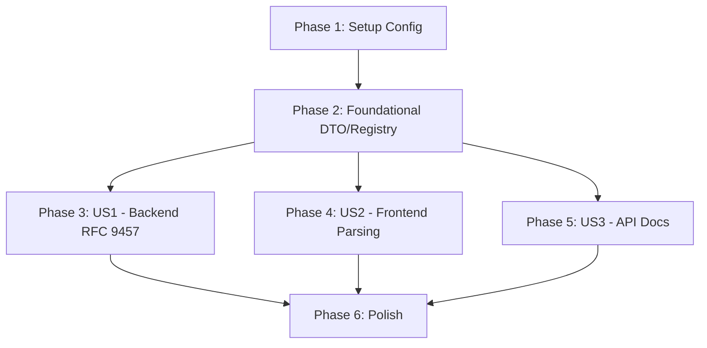

# Tasks: RFC 9457 Problem Details Error Format

**Input**: Design documents from `/specs/003-rfc9457-error-format/`

**Prerequisites**: plan.md (✅), spec.md (✅), research.md (✅), data-model.md (✅), contracts/ (✅), quickstart.md (✅)

**Tests**: Not requested — only existing test files are updated. No new test files created.

**Organization**: Tasks grouped by user story for independent implementation and testing.

## Format: `[ID] [P?] [Story] Description`

- **[P]**: Can run in parallel (different files, no shared dependencies)
- **[Story]**: Maps to user story from spec.md (US1, US2, US3)
- File paths are relative to repository root

---

## Phase 1: Setup (Config Infrastructure)

**Purpose**: Add `error_type_base_url` config field so the error handler can construct RFC 9457 `type` URIs per environment

- [x] T001 Add `ErrorTypeBaseURL` field to `AppConfig` struct in `internal/config/config.go`
- [x] T002 [P] Add `error_type_base_url` key with empty default to `configs/config.yaml`
- [x] T003 [P] Add `error_type_base_url` key with empty default to `configs/config.yaml.example`

---

## Phase 2: Foundational (DTO & Registry — Blocking Prerequisites)

**Purpose**: Replace the old DTOs and error registry entries with RFC 9457-compliant structures. ALL user story phases depend on this phase.

**⚠️ CRITICAL**: No user story work can begin until this phase is complete. The old `StructuredError`/`APIErrorResponse` types and `ErrorMapping` struct are the foundation everything else builds on.

- [x] T004 Replace `StructuredError` and `APIErrorResponse` with `ProblemDetail` struct conforming to RFC 9457 in `internal/api/dto/error_dto.go`. Standard fields: `Type`, `Title`, `Status`, `Detail`, `Instance`. Extension fields: `Code`, `RequestID`, `Errors` (rename `ErrorDetail` → `ValidationError`).
- [x] T005 Update `ErrorMapping` struct to add `TypeSlug` (string) and `Title` (string) fields alongside existing `Status`, `Code`; rename `Message` → `Detail` in `internal/api/middleware/error_registry.go`. Update all 18 sentinel error mappings with correct type slugs and titles.
- [x] T006 [P] Update `TestAPIErrorResponse_Marshal_Full` and `TestAPIErrorResponse_Marshal_NoDetails` to validate RFC 9457 `ProblemDetail` structure (no `{"error":{...}}` wrapper, top-level `type`/`title`/`status`/`detail`/`instance`) in `internal/api/dto/error_dto_test.go`
- [x] T007 [P] Update `TestLookupError_Known`, `TestLookupError_Unknown`, `TestLookupError_Wrapped` to assert new `ErrorMapping` fields (`TypeSlug`, `Title`, `Detail`) are populated in `internal/api/middleware/error_registry_test.go`

**Checkpoint**: DTOs and registry ready — user story implementation can begin

---

## Phase 3: User Story 1 - API Consumers Receive RFC 9457-Compliant Error Responses (Priority: P1) 🎯 MVP

**Goal**: Every error response from the backend middleware follows RFC 9457 structure with `type`, `title`, `status`, `detail`, `instance` at top level, plus `code` and `request_id` extensions, and `Content-Type: application/problem+json`.

**Independent Test**: Call 3 endpoints producing different error types (not-found, validation, unauthorized) and verify all responses conform to RFC 9457.

### Implementation for User Story 1

- [x] T008 [US1] Update `ErrorHandler` to construct `ProblemDetail` from `ErrorMapping`: set `Type` from configurable base URL + `TypeSlug` (fallback to `about:blank` if empty), `Title` from mapping, `Status` from mapping, `Detail` from mapping, `Instance` from `c.Request().URL.Path`, `Code` from mapping, `RequestID` from Echo header in `internal/api/middleware/error_handler.go`
- [x] T009 [US1] Set `Content-Type: application/problem+json` header on all error responses (override Echo's default `application/json` from `c.JSON()`) in `internal/api/middleware/error_handler.go`
- [x] T010 [US1] Accept `errorTypeBaseURL` config parameter in `ErrorHandler` constructor; construct type URIs by concatenating base URL + `/{typeSlug}` (e.g., `https://api.project-one.dev/errors/not-found`) in `internal/api/middleware/error_handler.go`
- [x] T011 [US1] Wire `cfg.App.ErrorTypeBaseURL` from config into `ErrorHandler` call in `cmd/main.go`
- [x] T012 [US1] Update validation error serialization: rename `validationDetails()` → `validationErrors()`, output to `ProblemDetail.Errors` extension array instead of nested `details` in `internal/api/middleware/error_handler.go`
- [x] T013 [US1] Update `TestErrorHandler_MapsStatus` to assert `Content-Type: application/problem+json`, RFC 9457 top-level fields (`type`, `title`, `status`, `detail`, `instance`), and no `{"error":{...}}` wrapper in `internal/api/middleware/error_handler_test.go`
- [x] T014 [US1] Update `TestErrorHandler_UnknownDefaultsTo500` to assert `type: about:blank` and `title: Internal Server Error` in `internal/api/middleware/error_handler_test.go`
- [x] T015 [US1] Add test case for validation error response asserting `errors` extension array at top level with `field`, `reason`, `message` items in `internal/api/middleware/error_handler_test.go`
- [x] T016 [US1] Verify all existing endpoints return semantically equivalent HTTP status codes by running existing test suite: `go test ./internal/api/handler/... -v`

**Checkpoint**: Backend RFC 9457 response format complete. All error responses use `application/problem+json` with Problem Detail structure. Existing status codes unchanged.

---

## Phase 4: User Story 2 - Frontend Error-Handling Utilities Adapt to RFC 9457 Format (Priority: P2)

**Goal**: Frontend error parsing utilities extract error information from RFC 9457 `ProblemDetail` fields instead of the old `{"error":{...}}` wrapper. UI components display `detail` as the user message and `errors` array for form validation.

**Independent Test**: Mock an RFC 9457 response and verify the frontend extracts `detail` as the user-facing message, `status` as the HTTP code, and `errors` as field-level validation details.

### Implementation for User Story 2

- [x] T017 [P] [US2] Define `ProblemDetail` and `ValidationError` TypeScript interfaces matching the Go DTO in `web/lib/errors.ts`
- [x] T018 [P] [US2] Update `ApiError` class constructor to accept `ProblemDetail` and store `status`, `code`, `type`, `instance`, `validationErrors` fields in `web/lib/errors.ts`
- [x] T019 [US2] Update `handleApiResponse` to check `content-type: application/problem+json`, parse body as `ProblemDetail`, and construct `ApiError` from problem detail fields in `web/lib/errors.ts`
- [x] T020 [US2] Update `use-error-modal` hook to extract error message from `detail` field (was `error.message`) in `web/hooks/use-error-modal.tsx` — no structural changes, only data extraction path
- [x] T021 [US2] Update `error-modal` component to display `detail` (with `title` as heading when available) in `web/components/layout/error-modal.tsx` — no visual change, field name remap only
- [x] T022 [P] [US2] Update frontend unit tests to mock RFC 9457 `ProblemDetail` responses and assert correct field extraction in `web/tests/lib/errors.test.ts`
- [x] T023 [P] [US2] Update error modal tests to use RFC 9457 mock responses in `web/tests/hooks/use-error-modal.test.tsx`

**Checkpoint**: Frontend parses RFC 9457 error responses correctly. All existing error UI behaviors preserved (modal display, toast notifications, form field errors).

---

## Phase 5: User Story 3 - RFC 9457 Error Schema Is Documented in API Documentation (Priority: P3)

**Goal**: Swagger/OpenAPI docs reference `application/problem+json` content type and `ProblemDetail` schema for all documented error responses.

**Independent Test**: Open API docs and verify error responses show `application/problem+json` and RFC 9457 problem detail schema.

### Implementation for User Story 3

- [x] T024 [P] [US3] Add swaggo annotation comments to `ProblemDetail` struct for OpenAPI schema generation in `internal/api/dto/error_dto.go`
- [x] T025 [US3] Update all `@Failure` annotations from `{object} dto.APIErrorResponse` to `{object} dto.ProblemDetail` in `internal/api/handler/user_handler.go`
- [x] T026 [P] [US3] Update all `@Failure` annotations from `{object} dto.APIErrorResponse` to `{object} dto.ProblemDetail` in `internal/api/handler/post_handler.go`
- [x] T027 [P] [US3] Update all `@Failure` annotations from `{object} dto.APIErrorResponse` to `{object} dto.ProblemDetail` in `internal/api/handler/comment_handler.go`
- [x] T028 [P] [US3] Update all `@Failure` annotations from `{object} dto.APIErrorResponse` to `{object} dto.ProblemDetail` in `internal/api/handler/notification_handler.go`
- [x] T029 [P] [US3] Update all `@Failure` annotations from `{object} dto.APIErrorResponse` to `{object} dto.ProblemDetail` in `internal/api/handler/feed_handler.go`
- [x] T030 [US3] Regenerate Swagger docs with `make docs` and verify `application/problem+json` appears in generated `api/swagger/swagger.json` and `api/swagger/swagger.yaml`

**Checkpoint**: API documentation reflects RFC 9457 format. Consumers can discover the problem detail schema from generated docs.

---

## Phase 6: Polish & Cross-Cutting Concerns

**Purpose**: Final validation, cleanup, and quality gates

- [x] T031 Run `make check` (docs + vet + lint + test) from repository root and fix any issues
- [x] T032 Run `cd web && npm test && npm run lint` and fix any issues
- [x] T033 Verify RFC 9457 compliance per quickstart.md: test not-found (404), validation (400), unauthorized (401), conflict (409), and internal (500) responses with curl
- [x] T034 Validate a sample error response against `specs/003-rfc9457-error-format/contracts/problem-detail.schema.json` using a JSON Schema validator
- [x] T035 Remove any remaining references to old `dto.APIErrorResponse` or `dto.StructuredError` types across the codebase (grep for dead references)

---

## Dependencies

## Parallel Execution Opportunities

### Within Phase 2 (Foundational)
- T006 and T007 can run in parallel (test updates for DTO and registry respectively)

### Within Phase 3 (US1)
- T013, T014, T015 can run in parallel (all are test updates in same file — consider combining if single developer)

### Within Phase 4 (US2)
- T017 and T018 can run in parallel (TypeScript interfaces and ApiError class, different parts of same file — consider combining)
- T022 and T023 can run in parallel (frontend test updates, different files)

### Within Phase 5 (US3)
- T025, T026, T027, T028, T029 can all run in parallel (different handler files)

### Across User Stories (after Phase 2 complete)
- Phase 3 (US1), Phase 4 (US2), and Phase 5 (US3) can start in parallel since they touch different layers (backend middleware, frontend, handler annotations)

## Implementation Strategy

### MVP (User Story 1 Only)
1. Complete Phase 1 (Setup) — 3 tasks
2. Complete Phase 2 (Foundational) — 4 tasks
3. Complete Phase 3 (US1) — 9 tasks
4. **STOP and VALIDATE**: All error responses follow RFC 9457 with `application/problem+json`
5. Deploy backend independently — frontend will break until Phase 4 is complete

**MVP task count**: 16 tasks

### Incremental Delivery
1. **MVP** (Phases 1–3): Backend RFC 9457 format → deploy backend only
2. **+US2** (Phase 4): Frontend adapted → deploy full stack synchronously
3. **+US3** (Phase 5): Docs updated → deploy docs
4. **Polish** (Phase 6): Quality gates → final release

### Recommended Order
Since frontend depends on backend format (US2 needs US1 complete), the safest approach:
1. Phases 1–3 first (backend)
2. Immediately follow with Phase 4 (frontend)
3. Then Phase 5 (docs) and Phase 6 (polish) in parallel

---

## Phase 7: Convergence

**Purpose**: Address remaining gaps identified by `/speckit.converge` after Phase 6 implementation.

- [x] T036 Regenerate Swagger docs with `make docs` and verify `application/problem+json` content type appears in generated `api/swagger/swagger.json` and `api/swagger/swagger.yaml` per SC-005 / FR-016 (partial)
- [x] T037 [P] Run `cd web && npm test` to verify frontend tests pass with updated `ProblemDetail` interface; fix any test assertion failures per SC-004 / FR-014 (partial)
- [x] T038 Validate a sample error response against `specs/003-rfc9457-error-format/contracts/problem-detail.schema.json` using a JSON Schema validator per SC-001 / FR-001 (partial)
