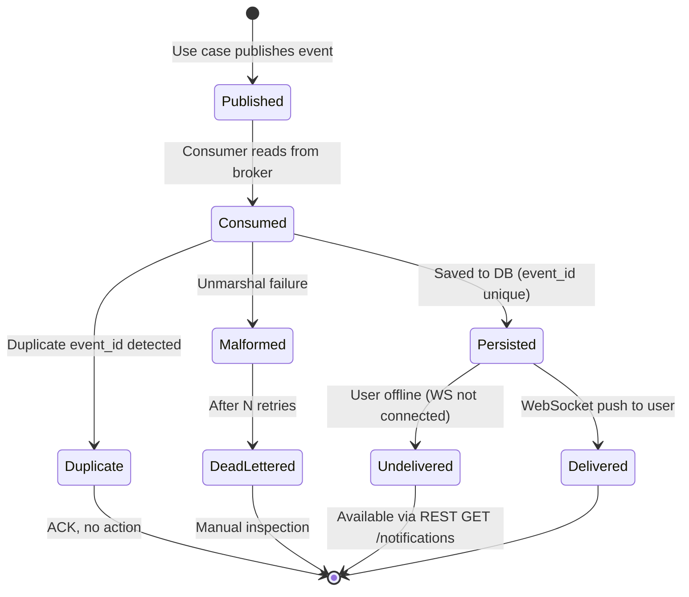

# Data Model: Notification Broker Integration

**Date**: 2026-07-25 | **Feature**: `004-notification-broker-integration`

## Entity Changes

### 1. Notification (Domain Entity) — Modified

**File**: `internal/core/domain/notification.go`

**Change**: Add `EventID` field for idempotency.

| Field | Type | Change | Description |
|-------|------|--------|-------------|
| `EventID` | `string` | **NEW** | Unique event identifier from the broker. Used as idempotency key. Must be non-empty on save. |
| `Type` | `NotificationType` | Existing | follow/like/comment |
| `ID` | `int` | Existing | Auto-increment DB primary key |
| `UserID` | `int` | Existing | Target user (notification recipient) |
| `ActorID` | `int` | Existing | User who triggered the notification |
| `ActorUsername` | `string` | Existing | Username of the actor |
| `PostID` | `int` | Existing | Related post (0 if not applicable) |
| `CommentID` | `int` | Existing | Related comment (0 if not applicable) |
| `IsRead` | `bool` | Existing | Read status |
| `CreatedAt` | `time.Time` | Existing | Creation timestamp |

**Database Migration**:

```sql
-- Up
ALTER TABLE notifications ADD COLUMN event_id VARCHAR(128) NOT NULL DEFAULT '';
CREATE UNIQUE INDEX idx_notifications_event_id ON notifications(event_id) WHERE event_id != '';

-- Down
DROP INDEX IF EXISTS idx_notifications_event_id;
ALTER TABLE notifications DROP COLUMN event_id;
```

The partial unique index (`WHERE event_id != ''`) allows existing rows (with empty `event_id`) to coexist while enforcing uniqueness for all new notifications from the broker.

### 2. Notification Event (Broker Message) — New

**Not a database entity** — this is the wire format published to and consumed from the message broker.

| Field | Type | Required | Description |
|-------|------|----------|-------------|
| `event_id` | `string` | Yes | Unique identifier for idempotency. Format: `<producer>-<uuid>` (e.g., `backend-a1b2c3d4`) |
| `schema_version` | `string` | Yes | Schema version (e.g., `"1.0"`) |
| `type` | `string` | Yes | `"follow"` / `"like"` / `"comment"` |
| `user_id` | `int` | Yes | Target user ID (recipient) |
| `actor_id` | `int` | Yes | Actor user ID (who triggered) |
| `actor_username` | `string` | Yes | Actor's username |
| `post_id` | `int` | No | Related post ID (0 if not applicable) |
| `comment_id` | `int` | No | Related comment ID (0 if not applicable) |
| `created_at` | `string` | Yes | ISO 8601 timestamp |
| `timestamp` | `string` | Yes | Event publication time (ISO 8601) |

### 3. Broker Connection Configuration — New

**File**: `internal/config/config.go`

**Change**: Add `MessageBrokerConfig` struct to `Config`.

```go
type MessageBrokerConfig struct {
    Type     string              `mapstructure:"type"`     // "kafka", "rabbitmq", "inmemory"
    Kafka    KafkaBrokerConfig   `mapstructure:"kafka"`
    RabbitMQ RabbitMQBrokerConfig `mapstructure:"rabbitmq"`
}

type KafkaBrokerConfig struct {
    Brokers       []string `mapstructure:"brokers"`
    TopicPrefix   string   `mapstructure:"topic_prefix"`
    ConsumerGroup string   `mapstructure:"consumer_group"`
    TLSEnabled    bool     `mapstructure:"tls_enabled"`
}

type RabbitMQBrokerConfig struct {
    URL      string `mapstructure:"url"`
    Exchange string `mapstructure:"exchange"`
    Queue    string `mapstructure:"queue"`
}
```

## State Transitions

### Notification Event Lifecycle



## Validation Rules

| Rule | Applies To | Enforcement |
|------|-----------|-------------|
| `event_id` must be non-empty | Notification creation | Domain validation + DB constraint |
| `event_id` must be unique | Notification creation | DB partial unique index |
| `type` must be one of: follow, like, comment | Notification creation | Domain validation |
| `user_id` must be > 0 | Notification creation | Domain validation |
| `actor_id` must be > 0 | Notification creation | Domain validation |
| Broker config `type` must be valid | Startup | Config validation |

## Relationships

```
Notification.EventID ─── 1:1 ─── Broker Event (idempotency link)
Notification.UserID  ─── N:1 ─── User (recipient)
Notification.ActorID ─── N:1 ─── User (actor)
Notification.PostID  ─── N:1 ─── Post (optional, 0 if N/A)
Notification.CommentID ─ N:1 ─── Comment (optional, 0 if N/A)
```
