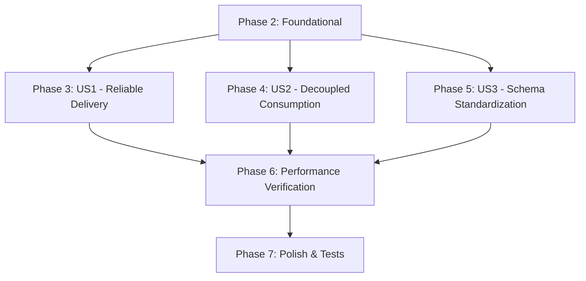

---

description: "Task list for Notification Broker Integration feature"
---

# Tasks: Notification Broker Integration

**Input**: Design documents from `/specs/004-notification-broker-integration/`

**Prerequisites**: [plan.md](./plan.md), [spec.md](./spec.md), [research.md](./research.md), [data-model.md](./data-model.md), [contracts/](./contracts/)

**Organization**: Tasks are grouped by user story to enable independent implementation and testing of each story.

## Format: `[ID] [P?] [Story] Description`

- **[P]**: Can run in parallel (different files, no dependencies)
- **[Story]**: Which user story this task belongs to (e.g., US1, US2, US3)
- Include exact file paths in descriptions

## Phase 1: Setup (Shared Infrastructure)

**Purpose**: Install new dependencies required by the broker adapters.

- [X] T001 Install `segmentio/kafka-go` and `rabbitmq/amqp091-go` dependencies via `go get`

## Phase 2: Foundational (Blocking Prerequisites)

**Purpose**: Domain model, config, migration, and factory that MUST be complete before ANY user story can begin.

**⚠️ CRITICAL**: No user story work can begin until this phase is complete.

- [X] T002 Add `EventID string` field to `domain.Notification` in `internal/core/domain/notification.go`
- [X] T003 Create migration `000015_add_event_id_to_notifications.up.sql` and `.down.sql` with partial unique index on `event_id` in `db/migrations/`
- [X] T004 [P] Add `MessageBrokerConfig` struct with Kafka and RabbitMQ sub-configs in `internal/config/config.go`
- [X] T005 [P] Add `message_broker` section to `configs/config.yaml` and `configs/config.yaml.example`
- [X] T006 [P] Create `NotificationEvent` envelope struct with `EventID`, `SchemaVersion`, `Timestamp` in `internal/core/domain/notification_event.go`
- [X] T007 Create broker factory `factory.go` in `internal/adapters/pubsub/` that returns `ports.Publisher` and `ports.Subscriber` based on `config.MessageBrokerConfig.Type`
- [X] T008 Update `cmd/main.go` to use broker factory instead of directly constructing in-memory publisher/subscriber, and pass `cfg.MessageBroker` to the factory

**Checkpoint**: Foundation ready — user story implementation can now begin.

---

## Phase 3: User Story 1 — Reliable Notification Delivery via Message Broker (Priority: P1) 🎯 MVP

**Goal**: Replace the in-memory pubsub with Kafka and RabbitMQ implementations that satisfy `ports.Publisher` and `ports.Subscriber`, with durable message delivery and idempotent consumption.

**Independent Test**: Start a broker (Kafka or RabbitMQ), publish a notification event, stop the consumer, publish another, restart the consumer — verify both events are persisted and delivered via WebSocket.

- [X] T009 [P] [US1] Implement Kafka `Publisher` and `Subscriber` in `internal/adapters/pubsub/kafka_pubsub.go` using `segmentio/kafka-go` — `Publish` writes to Kafka topic, `Subscribe` polls with `EventHandler` callback loop
- [X] T010 [P] [US1] Implement RabbitMQ `Publisher` and `Subscriber` in `internal/adapters/pubsub/rabbitmq_pubsub.go` using `rabbitmq/amqp091-go` — `Publish` publishes to exchange, `Subscribe` consumes from queue with `EventHandler` callback
- [X] T011 [US1] Update `handler/notification_handler.go` `Listen()` to extract `event_id` from broker event metadata and set it on `domain.Notification` before calling `SaveNotification`
- [X] T012 [US1] Add idempotent consumer logic in `handler/notification_handler.go` — when `SaveNotification` returns a unique constraint violation, log "duplicate event skipped" at DEBUG level and return nil (success) to ACK the message
- [X] T013 [P] [US1] Update `follow_usecase.go`, `post_usecase.go`, and `comment_usecase.go` to generate a unique `event_id` (format: `backend-<uuid>`) and include it in `event.Metadata` when publishing notification events
- [X] T014 [US1] Add graceful shutdown support — `Publisher.Close()` flushes pending messages; `Subscriber.Close()` waits for in-flight handler completion and commits offsets; wire into `application.shutdown()` in `cmd/main.go`

---

## Phase 4: User Story 2 — Decoupled Web App Consumption (Priority: P2)

**Goal**: Allow external consumers to subscribe to notification events from the broker independently, and provide a health check endpoint for broker status.

**Independent Test**: Run a standalone consumer subscribed to the broker's notification topic, publish an event from the backend, and verify the standalone consumer receives the correctly formatted event.

- [X] T015 [P] [US2] Add `GET /health/broker` endpoint that returns broker connection status (connected/disconnected) using publisher/subscriber health check methods
- [X] T016 [US2] Document external consumer setup instructions in `specs/004-notification-broker-integration/quickstart.md` — include example standalone consumer code and broker topic/queue configuration

---

## Phase 5: User Story 3 — Notification Event Schema Standardization (Priority: P3)

**Goal**: All published events include `schema_version` and `timestamp` fields, conforming to the v1.0 contract.

**Independent Test**: Capture a published event for each type (follow, like, comment) and validate it against the JSON Schema defined in `contracts/notification-event-schema.md`.

- [X] T017 [US3] Add `schema_version: "1.0"` metadata to all notification events published in `follow_usecase.go`, `post_usecase.go`, and `comment_usecase.go`
- [X] T018 [US3] Add `timestamp` (ISO 8601) metadata to all notification events published in `follow_usecase.go`, `post_usecase.go`, and `comment_usecase.go`

---

## Phase 6: Performance Verification

**Purpose**: Validate the feature meets latency and throughput success criteria before final polish.

- [X] T018a Run performance verification using [quickstart.md](./quickstart.md) Scenario 4 (burst of 10 notifications + SIGTERM): verify zero message loss (SC-001), p95 publish-to-WebSocket latency ≤2s (SC-002), and throughput of ≥1,000 events/min without API degradation (SC-003). Document results in `specs/004-notification-broker-integration/performance-results.md`.

---

## Phase 7: Polish & Cross-Cutting Concerns

**Purpose**: Tests, mocks, and final verification to ensure the feature is production-ready.

- [X] T019 [P] Write unit tests for Kafka adapter in `internal/adapters/pubsub/kafka_pubsub_test.go` — test `Publish` and `Subscribe` with an in-memory Kafka test instance or mocked `kafka.Writer`/`kafka.Reader`
- [X] T020 [P] Write unit tests for RabbitMQ adapter in `internal/adapters/pubsub/rabbitmq_pubsub_test.go` — test `Publish` and `Subscribe` with an in-memory RabbitMQ test instance or mocked `amqp.Channel`
- [X] T021 Write idempotency unit test for `SaveNotification` — verify that calling `SaveNotification` with a duplicate `EventID` does not create a duplicate record and returns no error
- [X] T022 Regenerate GoMock mocks via `make mock` and verify all interfaces compile
- [X] T023 Run `make check` (docs + vet + lint + test) and fix any issues

---

## Dependencies & Execution Order

### User Story Dependency Graph



### Task Dependency Graph

```text
Phase 2 (Foundational)
├── T002 (EventID field)
├── T003 (Migration)          ─ depends on T002
├── T004 (Config struct)      ─ [P]
├── T005 (Config files)       ─ [P]
├── T006 (Event envelope)     ─ [P]
├── T007 (Factory)            ─ depends on T004, T006
└── T008 (main.go)            ─ depends on T007

Phase 3 (US1)
├── T009 (Kafka adapter)      ─ [P] ─ depends on T001, T007
├── T010 (RabbitMQ adapter)   ─ [P] ─ depends on T001, T007
├── T011 (extract event_id)   ─ depends on T002, T009/T010
├── T012 (idempotent consume) ─ depends on T002, T003, T011
├── T013 (publish event_id)   ─ [P] ─ depends on T006
└── T014 (graceful shutdown)  ─ depends on T008, T009/T010

Phase 4 (US2)
├── T015 (health endpoint)    ─ [P] ─ depends on T007
└── T016 (external consumer docs) ─ depends on T009/T010

Phase 5 (US3)
├── T017 (schema_version)     ─ depends on T006, T013
└── T018 (timestamp)          ─ depends on T006, T013

Phase 6 (Performance)
└── T018a (load test)         ─ depends on T009/T010, T013

Phase 7 (Polish)
├── T019 (Kafka tests)        ─ [P] ─ depends on T009
├── T020 (RabbitMQ tests)     ─ [P] ─ depends on T010
├── T021 (idempotency tests)  ─ depends on T012
├── T022 (mocks)              ─ depends on all interface changes
└── T023 (make check)         ─ depends on all
```

### Parallel Execution Examples

**Within Phase 2**: T004 (config struct), T005 (config files), and T006 (event envelope) can be done in parallel since they modify different files.

**Within Phase 3**: T009 (Kafka adapter) and T010 (RabbitMQ adapter) can be implemented in parallel since they are independent packages. T013 (update 3 use case files) can be done in parallel since the use cases are independent of each other.

**Within Phase 7**: T019 (Kafka tests) and T020 (RabbitMQ tests) can be implemented in parallel.

---

## Implementation Strategy

1. **MVP = Phase 2 + Phase 3 only** (23 tasks total; MVP is T001–T014). This delivers the core value: reliable notification delivery via a message broker. Kafka and RabbitMQ are both implemented but only one needs to be configured and running for MVP validation.
2. **Phase 4 (US2)** and **Phase 5 (US3)** can be deferred without blocking the core feature.
3. **Phase 6 (Performance)** validates SC-001–SC-003 against a running broker. **Phase 7 (Polish)** should not be skipped — tests and lint are required by the constitution's pre-merge gates.
4. **In-memory fallback** remains the development default (`message_broker.type: inmemory`), so existing dev workflows are unaffected.

---

## Cross-Reference: Requirements → Tasks

| Requirement | Task(s) |
|-------------|---------|
| FR-001 (publish to broker) | T009, T010 |
| FR-002 (retain port interfaces) | T007 |
| FR-003 (at-least-once delivery) | T009, T010 |
| FR-004 (idempotent consumer) | T012 |
| FR-005 (configurable broker params) | T004, T005 |
| FR-006 (broker connection logging) | T009, T010 |
| FR-007 (unique event ID) | T013, T006 |
| FR-008 (all required fields) | T013, T006 |
| FR-009 (graceful degradation) | T014 |
| FR-010 (health check endpoint) | T015 |
| FR-011 (per-user ordering) | T009, T010 |
| FR-012 (graceful shutdown) | T014 |
| FR-013 (dead-letter mechanism) | T009, T010 |
| SC-001 (zero message loss) | T014, T018a |
| SC-002 (≤2s p95 latency) | T009, T010, T018a |
| SC-003 (1,000 events/min) | T009, T010, T018a |
| SC-004 (duplicate detection 100%) | T012 |
| SC-005 (broker outages do not cause API errors) | T014, T009, T010 |
| SC-006 (add consumer without producer changes) | T007, T009, T010 |

## Phase 8: Convergence

- [X] T024 Wire `NotificationEvent` envelope into publish flow — update `follow_usecase.go`, `post_usecase.go`, and `comment_usecase.go` to marshal `domain.NotificationEvent` instead of `domain.Notification` directly, producing snake_case JSON fields per the v1.0 contract in `contracts/notification-event-schema.md`. Also update `notification_handler.go` `Listen()` to unmarshal into `NotificationEvent` and extract the inner `Notification`. per US3/AC1, US3/AC2 (partial)
- [X] T025 Add Swagger annotation comment above `GET /health/broker` endpoint in `cmd/main.go` per Constitution: "New API endpoints MUST include Swagger annotations (`api/swagger/`)." per Constitution (missing)

## Phase 9: Convergence

- [X] T026 Refactor broker initialization and reconnect handling so RabbitMQ and Kafka are retried with backoff instead of aborting app startup, and log connect/disconnect/reconnect events per FR-006, FR-009 (missing)
- [X] T027 Back `GET /health/broker` with real publisher/subscriber health checks instead of a hard-coded healthy response per FR-010 (partial)
- [X] T028 Flatten the published `NotificationEvent` payload to match `contracts/notification-event-schema.md`, validate `schema_version`, and include `comment_id` for comment notifications per US3/AC1, US3/AC2, FR-008 (contradicts)
- [X] T029 Add dead-letter routing after the configurable retry limit for malformed or unprocessable broker events in both adapters per FR-013 (missing)
- [X] T030 Wait for in-flight subscriber handlers to finish and flush pending publisher messages during shutdown per FR-012 (partial)
- [X] T031 Partition or serialize notification consumption by target user instead of globally so notifications for different users can be processed concurrently per FR-011 (partial)

## Phase 10: Convergence

- [X] T032 Restore the default in-memory fallback by sharing one `inMemoryPubSub` instance between `NewPublisher` and `NewSubscriber` in `internal/adapters/pubsub/factory.go` so published notifications reach subscribers under `message_broker.type: inmemory` per plan: in-memory fallback (contradicts)
- [X] T033 Route like/comment notification events by target user and add per-user broker-side serialization or partitioning in the pubsub adapters so ordering is preserved per recipient while different users can be processed concurrently per FR-011 (partial)
