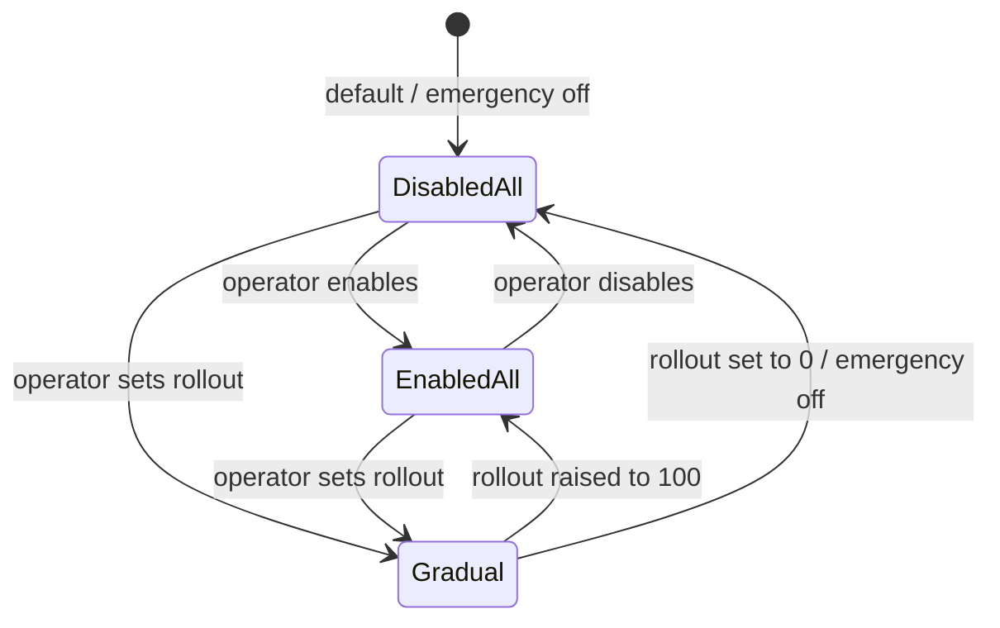

# Data Model: Runtime Feature Flags

**Date**: 2026-09-08 | **Feature**: `005-feature-flags`

## Entities

### 1. FeatureFlag — New

**File**: `internal/core/domain/feature_flag.go`

| Field | Type | Notes |
|-------|------|-------|
| `ID` | `int` | Auto-increment primary key |
| `Key` | `string` | Permanent, unique after `lower(trim())`; immutable; never reused (FR-018) |
| `Name` | `string` | Human-readable name |
| `Purpose` | `string` | Description of what the flag guards and why (required) |
| `Owner` | `string` | Accountable owner (required) |
| `LifecycleState` | `LifecycleState` | `active` \| `archived` (FR-019) |
| `SafeDefault` | `bool` | Declared safe default (normally `false`; operator may set `true`) |
| `CreatedAt` | `time.Time` | Creation timestamp |
| `UpdatedAt` | `time.Time` | Last metadata update |

### 2. EnvironmentSetting — New

**File**: `internal/core/domain/feature_flag.go`

One row per (flag, environment).

| Field | Type | Notes |
|-------|------|-------|
| `FlagID` | `int` | FK → `feature_flags.id` |
| `Environment` | `Environment` | `local` \| `test` \| `staging` \| `production` (FR-004) |
| `Mode` | `AvailabilityMode` | `disabled_all` \| `enabled_all` \| `gradual` (FR-006) |
| `RolloutPercentage` | `int` | 0–100; only meaningful in `gradual` mode (FR-007) |
| `Revision` | `int` | Monotonic counter for optimistic concurrency (FR-017) |
| `CreatedAt` | `time.Time` | |
| `UpdatedAt` | `time.Time` | |

### 3. UserOverride — New

**File**: `internal/core/domain/feature_flag.go`

One row per (flag, environment, username, type).

| Field | Type | Notes |
|-------|------|-------|
| `FlagID` | `int` | FK → `feature_flags.id` |
| `Environment` | `Environment` | |
| `Username` | `string` | Existing signed-in user identifier (FR-009) |
| `Type` | `OverrideType` | `include` \| `exclude` |
| `CreatedAt` | `time.Time` | |

### 4. AuditRecord — New (insert-only)

**File**: `internal/core/domain/feature_flag.go`

| Field | Type | Notes |
|-------|------|-------|
| `ID` | `int` | Auto-increment primary key |
| `FlagID` | `int` | FK → `feature_flags.id` |
| `Environment` | `*Environment` | Nullable — metadata changes are not environment-scoped (FR-016) |
| `Field` | `string` | What changed (e.g., `mode`, `rollout_percentage`, `archive`) |
| `PreviousValue` | `string` | Serialized prior value |
| `NewValue` | `string` | Serialized new value |
| `Actor` | `string` | Username of the operator |
| `Reason` | `string` | Required change reason |
| `CreatedAt` | `time.Time` | Immutable timestamp |

### 5. FeatureFlagDecision — New (value object, not persisted)

**File**: `internal/core/domain/feature_flag.go`

| Field | Type | Notes |
|-------|------|-------|
| `Enabled` | `bool` | Final decision |
| `Source` | `string` | `archived`, `disabled_all`, `exclude`, `include`, `gradual`, `enabled_all`, `safe_default` |
| `FlagKey` | `string` | Echoed back for correlation |
| `Reason` | `string` | Human-readable explanation for operators/debugging |

---

## Enumerations

```go
type LifecycleState string
const (
    LifecycleActive   LifecycleState = "active"
    LifecycleArchived LifecycleState = "archived"
)

type Environment string
const (
    EnvironmentLocal      Environment = "local"
    EnvironmentTest       Environment = "test"
    EnvironmentStaging    Environment = "staging"
    EnvironmentProduction Environment = "production"
)

type AvailabilityMode string
const (
    ModeDisabledAll AvailabilityMode = "disabled_all"
    ModeEnabledAll  AvailabilityMode = "enabled_all"
    ModeGradual     AvailabilityMode = "gradual"
)

type OverrideType string
const (
    OverrideInclude OverrideType = "include"
    OverrideExclude OverrideType = "exclude"
)
```

---

## Database Migrations

### 000018 — feature_flags

```sql
-- Up
CREATE TABLE feature_flags (
    id            BIGSERIAL PRIMARY KEY,
    key           VARCHAR(128) NOT NULL,
    name          VARCHAR(255) NOT NULL,
    purpose       TEXT NOT NULL,
    owner         VARCHAR(255) NOT NULL,
    lifecycle     VARCHAR(16) NOT NULL DEFAULT 'active',
    safe_default  BOOLEAN NOT NULL DEFAULT FALSE,
    created_at    TIMESTAMPTZ NOT NULL DEFAULT now(),
    updated_at    TIMESTAMPTZ NOT NULL DEFAULT now()
);
CREATE UNIQUE INDEX ux_feature_flags_key ON feature_flags (lower(trim(key)));

-- Down
DROP TABLE feature_flags;
```

### 000019 — feature_flag_settings

```sql
-- Up
CREATE TABLE feature_flag_settings (
    id                 BIGSERIAL PRIMARY KEY,
    flag_id            BIGINT NOT NULL REFERENCES feature_flags(id) ON DELETE CASCADE,
    environment        VARCHAR(16) NOT NULL,
    mode               VARCHAR(16) NOT NULL DEFAULT 'disabled_all',
    rollout_percentage INTEGER NOT NULL DEFAULT 0 CHECK (rollout_percentage BETWEEN 0 AND 100),
    revision           INTEGER NOT NULL DEFAULT 1,
    created_at         TIMESTAMPTZ NOT NULL DEFAULT now(),
    updated_at         TIMESTAMPTZ NOT NULL DEFAULT now(),
    UNIQUE (flag_id, environment)
);

-- Down
DROP TABLE feature_flag_settings;
```

### 000020 — feature_flag_overrides

```sql
-- Up
CREATE TABLE feature_flag_overrides (
    id          BIGSERIAL PRIMARY KEY,
    flag_id     BIGINT NOT NULL REFERENCES feature_flags(id) ON DELETE CASCADE,
    environment VARCHAR(16) NOT NULL,
    username    VARCHAR(255) NOT NULL,
    type        VARCHAR(8) NOT NULL CHECK (type IN ('include','exclude')),
    created_at  TIMESTAMPTZ NOT NULL DEFAULT now(),
    UNIQUE (flag_id, environment, username)
);

-- Down
DROP TABLE feature_flag_overrides;
```

The single `UNIQUE (flag_id, environment, username)` constraint prevents a user from appearing in both include and exclude lists for the same flag and environment (FR-020).

### 000021 — feature_flag_audit_logs

```sql
-- Up
CREATE TABLE feature_flag_audit_logs (
    id             BIGSERIAL PRIMARY KEY,
    flag_id        BIGINT NOT NULL REFERENCES feature_flags(id) ON DELETE CASCADE,
    environment    VARCHAR(16),
    field          VARCHAR(64) NOT NULL,
    previous_value TEXT,
    new_value      TEXT,
    actor          VARCHAR(255) NOT NULL,
    reason         TEXT NOT NULL,
    created_at     TIMESTAMPTZ NOT NULL DEFAULT now()
);
CREATE INDEX idx_feature_flag_audit_flag_created
    ON feature_flag_audit_logs (flag_id, created_at DESC);

-- Down
DROP TABLE feature_flag_audit_logs;
```

---

## State Transitions

### Flag Lifecycle

```mermaid
stateDiagram-v2
    [*] --> Active: Create (key unique, metadata complete)
    Active --> Active: Update metadata (no key change)
    Active --> Archived: Archive (operator + reason)
    Archived --> [*]: (immutable; history retained; key never reused)
```



### Availability Mode



Each transition increments `revision` and writes an audit record.

---

## Validation Rules

| Rule | Enforcement |
|------|-------------|
| Key required, ≤128 chars, `[a-zA-Z0-9._-]` | Domain validation + DB unique index |
| Key unique after `lower(trim())`, immutable, never reused | DB functional unique index + application check |
| Name, purpose, owner, reason required | Domain + `validator/v10` |
| Lifecycle must be `active` or `archived`; archived flags immutable | Domain + use case |
| Mode must be one of `disabled_all` / `enabled_all` / `gradual` | Domain |
| Rollout percentage 0–100 | Domain + DB `CHECK` |
| No duplicate override for same (flag, environment, username) | DB unique constraint |
| Updates carry matching `revision` (else 409) | Use case + repository |
| Operator allowlist membership | Middleware |

---

## Relationships

```text
FeatureFlag 1 ─── N EnvironmentSetting   (one setting per environment)
FeatureFlag 1 ─── N UserOverride          (per environment + user)
FeatureFlag 1 ─── N AuditRecord           (insert-only history)

EnvironmentSetting.revision ─── optimistic concurrency token
FeatureFlagDecision          ─── computed value object (not persisted)
```
