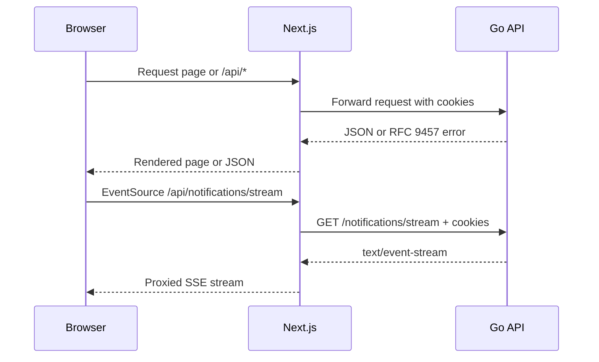

# Project One frontend

The frontend is a Next.js 16.2.9 App Router application built with React 19.2.4, TypeScript, and Tailwind CSS 4. It communicates with the Go API through same-origin Next.js route handlers, so the backend URL and authentication cookies stay on the server side.

## User-facing features

- Registration, login, logout, and session-expiration feedback
- A cursor-paginated home feed with automatic infinite-scroll loading
- Post creation, post browsing, post details, comments, likes, and author-only controls
- User profiles, follower/following lists, follow actions, password changes, and profile editing
- User search with debounced suggestions and a full results page
- Persistent notifications with optimistic read actions and live SSE delivery
- Loading skeletons, route-level error states, and a reusable accessible error modal
- Responsive navigation and a custom editorial design system

## Routes

| Route | Purpose |
| :--- | :--- |
| `/` | Authenticated personal feed |
| `/login` | Login form |
| `/register` | Registration form |
| `/posts` | All posts |
| `/posts/create` | Create a post |
| `/posts/[id]` | Post detail, likes, and comments |
| `/[username]` | Public-profile view inside the authenticated application shell |
| `/search?q=...` | User search results |
| `/settings/profile/edit` | Edit the signed-in user's name and username |

The Next.js proxy allows `/login`, `/register`, `/error`, static assets, and `/api/*` without a local session check. Other page routes require an `access_token` cookie and redirect to login when it is absent. The Go API still validates the token for every protected operation.

## Rendering and request flow

- Server Components render feeds, post lists/details, profiles, search results, and the profile editor's initial data.
- Client Components handle interactive forms, infinite scrolling, dropdowns, modals, comments, likes, follow actions, and notifications.
- The post creation form uses a Server Action.
- Route handlers under `app/api` proxy REST operations to the Go backend.
- `serverFetch` calls those same-origin route handlers from Server Components while forwarding the current cookies.



## Setup

### Prerequisites

- Node.js 24 and npm
- The Go API running at `http://localhost:8080`, or the URL supplied through `API_URL`

### Install and run

```bash
npm ci
API_URL=http://localhost:8080 npm run dev
```

Open <http://localhost:3000>.

Only one application environment variable is used:

| Variable | Default | Description |
| :--- | :--- | :--- |
| `API_URL` | `http://localhost:8080` | Server-only base URL for the Go backend |

Set it in `.env.local` for persistent local configuration:

```dotenv
API_URL=http://localhost:8080
```

There are no browser-exposed WebSocket settings. Live notifications use the same-origin `/api/notifications/stream` SSE route and authenticate with the existing cookies.

## Live notifications

`NotificationSseClient` wraps the browser's `EventSource` API. It listens for both named `notification` events and ordinary message events, normalizes the payload, deduplicates notifications by ID, and exposes connected/reconnecting/offline state.

When the stream reconnects, the notification hook retrieves the current notification list over REST and merges any missed entries. Mark-one and mark-all actions update the interface optimistically and restore the prior state when the API request fails.

## Project structure

```text
web/
├── app/
│   ├── api/                     # Backend-for-frontend route handlers
│   ├── [username]/              # User profile route
│   ├── login/ and register/     # Authentication pages and skeletons
│   ├── posts/                   # List, detail, and creation routes
│   ├── search/                  # Search results
│   └── settings/profile/edit/   # Profile editor
├── components/
│   ├── layout/                  # Navbar, search, footer, and errors
│   ├── notification/            # Notification dropdown and list
│   ├── posts/                   # Feed and post interaction components
│   ├── profile/                 # Profile, follow, password, and edit UI
│   └── ui/                      # Shared form, modal, avatar, and skeleton UI
├── hooks/                       # Notification, profile, user, and error state
├── lib/
│   ├── api-proxy.ts             # Shared REST proxy implementation
│   ├── server-fetch.ts          # Same-origin Server Component fetch helper
│   ├── notifications-*.ts       # Notification REST and SSE clients
│   └── types/ and utils/        # Schemas, types, and formatting helpers
├── tests/                       # Vitest component, hook, and page tests
├── proxy.ts                     # Next.js 16 page-route session guard
└── Dockerfile                   # Standalone production image
```

## Commands

| Command | Description |
| :--- | :--- |
| `npm run dev` | Start the development server |
| `npm run build` | Create the standalone production build |
| `npm run start` | Run a locally built production app |
| `npm run lint` | Run ESLint |
| `npm test -- --run` | Run the Vitest suite once |
| `npm run test:ui` | Start the Vitest UI |
| `npm run test:coverage` | Run tests with V8 coverage |

The current tests cover the feed's empty state, cursor pagination, and retry behavior; notification actions; profile-dropdown logout behavior; error-modal behavior; page skeletons; and login-page validation and submission states.

## Container build

The frontend Dockerfile builds a Next.js standalone output with Node.js 24 and runs it as the unprivileged `node` user on port 3000. From the repository root, `make compose-up` builds the frontend together with PostgreSQL, RabbitMQ, and the Go API.
